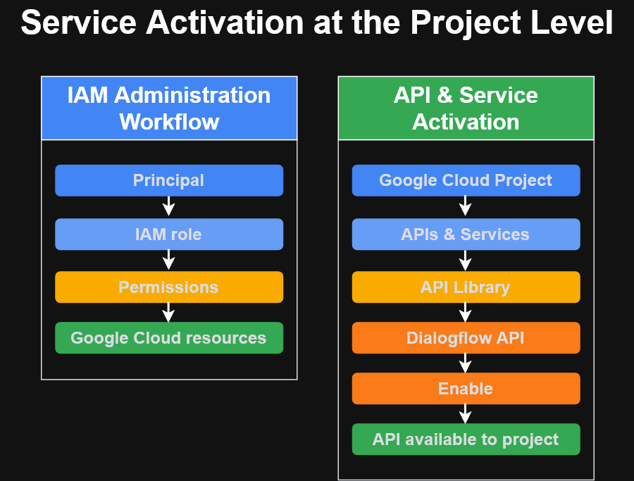

# GSP282 — A Tour of Google Cloud Hands-on Labs

**Level:** Introductory  
**Platform:** Google Skills / Qwiklabs

## Key Areas

- Google Cloud Console
- Google Cloud projects
- IAM principals, roles, and permissions
- API Library
- Dialogflow API activation

## Service Activation at the Project Level

