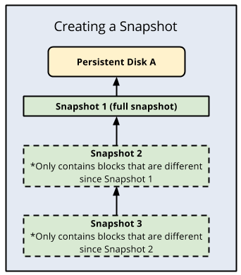
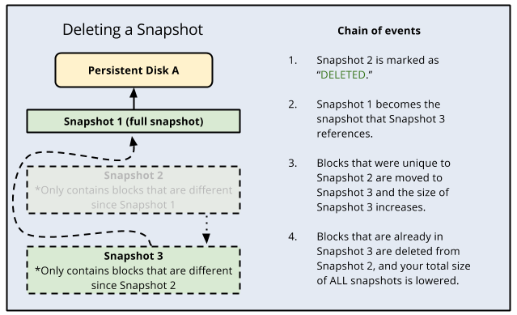

## Snapshot Operations Diagrams

These diagrams document Google Cloud Compute Engine snapshot lifecycle behavior, incremental backup relationships, and deletion dependency chains used in operational disaster recovery workflows.

### Incremental Snapshot Behavior

### Snapshot Deletion Dependency Chain

