# Google Cloud Observability

## Overview

Google Cloud Observability provides integrated monitoring, logging,
diagnostics, tracing, and application-performance tools for cloud systems.

It can dynamically discover cloud resources and application services
across environments such as Google Cloud and AWS.

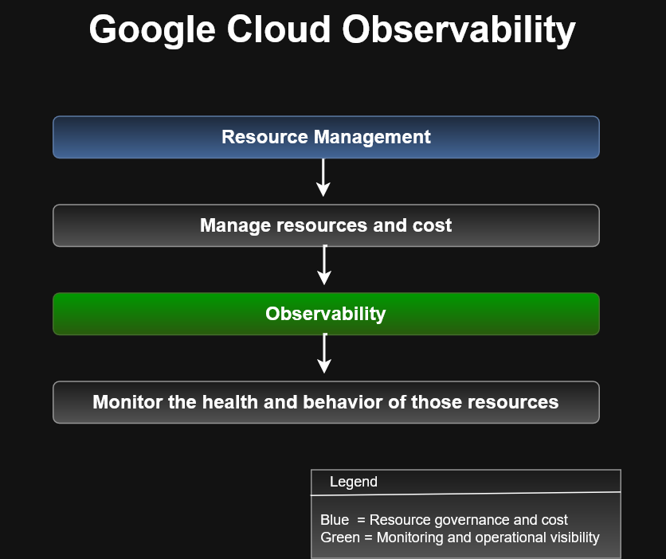

## Core Services

| Service | Purpose |
|---|---|
| Cloud Monitoring | Metrics, dashboards, uptime, and alerts |
| Cloud Logging | Centralized log collection and analysis |
| Error Reporting | Detect and group application errors |
| Cloud Trace | Analyze request latency and distributed traces |
| Cloud Profiler | Analyze CPU and memory usage in applications |

## Why Observability Matters

Observability helps cloud engineers:

- Detect failures
- Investigate incidents
- Monitor resource health
- Analyze application performance
- Diagnose latency
- Review logs
- Establish operational visibility

## ACE Recognition Note

Think:

Metrics → Monitoring  
Logs → Logging  
Exceptions → Error Reporting  
Request latency → Trace  
CPU / memory hot spots → Profiler

```text
Google Cloud Observability
        │
        ├── Monitoring
        ├── Logging
        ├── Error Reporting
        ├── Trace
        └── Profiler
```

Important operational concept is:

```text
Monitoring → What is happening?
Logging → What happened?
Error Reporting → What is failing?
Trace → Where is the request slowing down?
Profiler → Where is the application consuming resources?
```

## Cloud Monitoring

Cloud Monitoring provides visibility into platform, system, and
application performance.

It can dynamically configure monitoring after resources are deployed
and provides intelligent defaults for common monitoring tasks.

Monitoring data can include:

- Metrics
- Events
- Metadata

That data can then be used to build:

- Dashboards
- Charts
- Alerts
- Uptime checks
- Health checks

---

### Metrics Scopes

A metrics scope is the root entity that holds monitoring and
configuration information for monitored projects.

A metrics scope can include:

- Custom dashboards
- Alerting policies
- Uptime checks
- Notification channels
- Group definitions

A single metrics scope can monitor multiple Google Cloud projects.

Conceptually:

```text
                  Metrics Scope
                       |
        +--------------+--------------+
        |              |              |
   Project A        Project B      Project C
                                      |
                               AWS Connector
                                      |
                                AWS Account
```
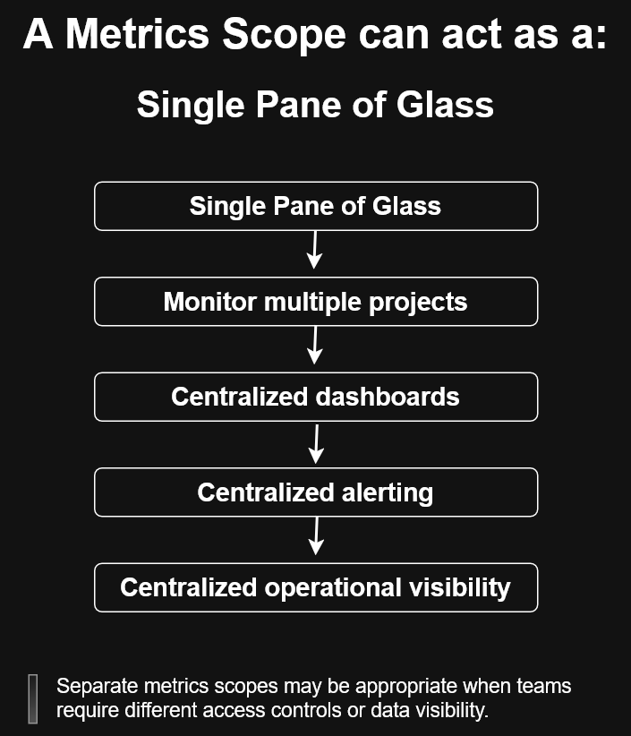


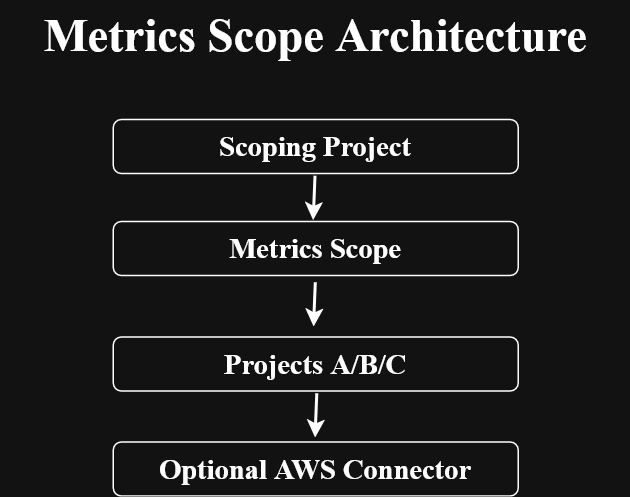

---

### Dashboards

Cloud Monitoring dashboards can visualize metrics such as:

- CPU utilization
- Network traffic
- Packets sent
- Packets received
- Dropped packets

Charts can use:

- Filters
- Groups
- Aggregations

Dashboards provide visual operational awareness, but they require
someone to be looking at them.

---

### Alerting Policies

Alerting policies automatically notify operators when defined
conditions are met.

Conceptually:
```text
Metric
  ↓
Condition
  ↓
Threshold
  ↓
Duration
  ↓
Alert
  ↓
Notification channel
```
Example:

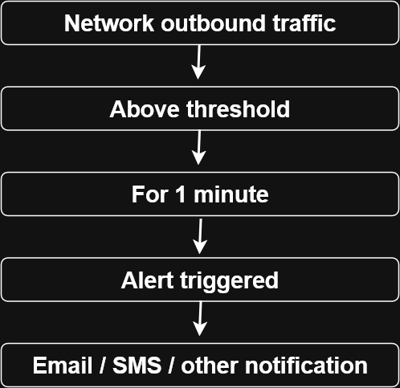

#### Alerting Best Practices
- Alert on symptoms rather than only causes
- Use multiple notification channels
- Make alerts actionable
- Include troubleshooting guidance
- Avoid unnecessary alert noise

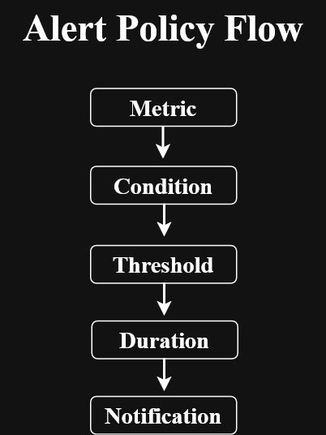
```text
Dashboard = passive visibility

Alert = active notification
```
---

## Uptime Checks

Uptime checks test whether public services are reachable and responding.

They can check services from multiple locations and can be configured for:

- HTTP
- HTTPS
- TCP

Examples of monitored resources include:

- Compute Engine instances
- App Engine applications
- Public host URLs
- AWS instances or load balancers

An uptime check can be associated with an alerting policy.

Conceptually:

```text
Public Service
     ↓
Uptime Check
     ↓
Multiple Global Locations
     ↓
Availability / Latency
     ↓
Alerting Policy
     ↓
Notification
```
The course example checks a service every minute with a 10-second timeout.
A failed response within the timeout is treated as an uptime failure.

---

## Ops Agent
The Ops Agent collects telemetry from inside Compute Engine virtual machines.

This is important because some internal VM metrics cannot be observed directly
from the hypervisor.

The Ops Agent can collect:

- Host metrics
- Process metrics
- Application metrics
- Metrics from supported third-party applications

Conceptually:
```text
Compute Engine VM
      ↓
   Ops Agent
      ↓
Cloud Monitoring API
      ↓
+------------------------------+
| Dashboards                   |
| Uptime checks                |
| Alerting policies            |
| Notifications                |
+------------------------------+
```
> The Ops Agent collects system and application telemetry from
> Compute Engine VM instances and sends it to Cloud Monitoring.

---
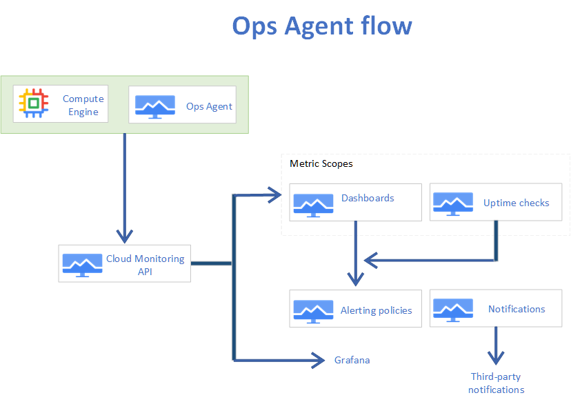

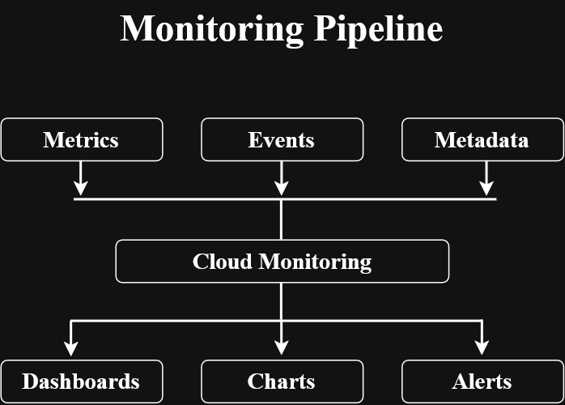


---
## Custom Metrics

If built-in Monitoring metrics do not represent the condition that matters to
an application, custom metrics can be created.

Example:
```text
Game Server
Capacity = 50 users
```
Instead of estimating load using:
```text
CPU utilization
Network traffic
```
the application can publish:
```text
current_users
```
directly as a custom metric.

This provides a more meaningful application-level signal.

Conceptually:
```text
Application
    ↓
Custom Metric
    ↓
Time Series
    ↓
Cloud Monitoring
    ↓
Dashboard / Alert / Autoscaling
```

### Custom Metric to Time Series

This diagram shows how an application-defined metric becomes time-series data in Cloud Monitoring and can then drive dashboards, alerts, or autoscaling.

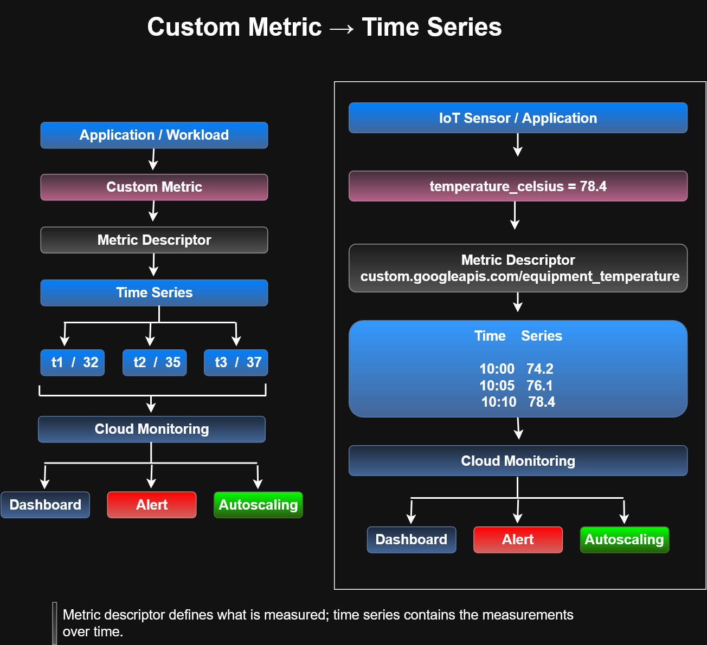

---

## Autoscaling with Metrics

Managed instance groups can autoscale based on monitoring metrics.

The core idea is:
```text
Metric
  ↓
Utilization Target
  ↓
Compare Current Value
  ↓
Scale Out / Scale In
```
If the metric is produced by each VM in the managed instance group:
```text
VM metrics
   ↓
Average metric value across VMs
   ↓
Compare with utilization target
```
If the metric represents the entire managed instance group:
```text
Group-wide metric
   ↓
Compare directly with utilization target
```
If the metric has multiple values:
```text
Metric
  ↓
Filter
  ↓
Select individual value
  ↓
Autoscaling decision
```
### Metric-Based Autoscaling Flow

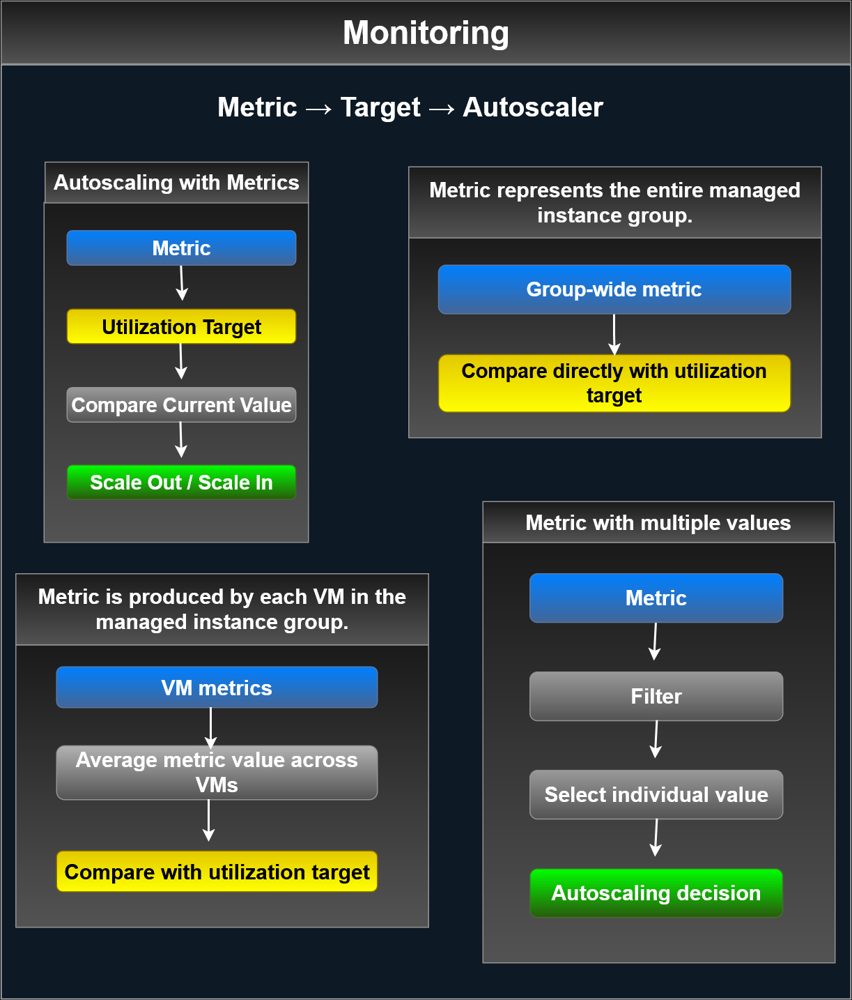


## ACE Recognition
```text
Uptime check
→ Is the service reachable?

Ops Agent
→ What is happening inside the VM?

Custom metric
→ What application-specific value do I want to measure?

Alerting policy
→ When should someone be notified?

Autoscaling metric
→ When should capacity change automatically?
```

## Cloud Logging

Cloud Logging is a fully managed service for storing, searching,
analyzing, monitoring, and alerting on log data from Google Cloud
and AWS environments.

Cloud Logging can collect:

- Platform logs
- System logs
- Application logs

Core capabilities include:

- Reading and writing log entries
- Searching and filtering logs
- Logs Explorer
- Log-based metrics
- Alerting on log events
- Routing logs to other Google Cloud services

### Log Routing

Logs can be routed to different destinations depending on the use case:

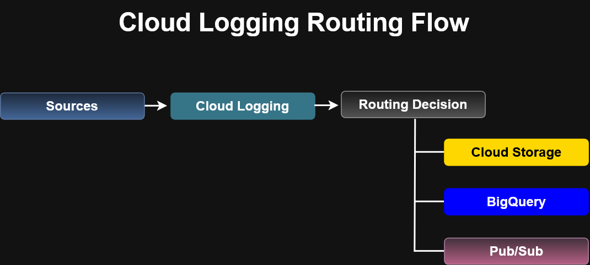

Typical destinations include:

- Cloud Storage for long-term retention
- BigQuery for SQL analysis
- Pub/Sub for streaming and automation


```text
Cloud Logging
     |
     +--> Cloud Storage
     |      Long-term storage
     |
     +--> BigQuery
     |      SQL analysis / reporting
     |
     +--> Pub/Sub
            Streaming / automation
```

### BigQuery Log Analysis

Routing logs to BigQuery enables large-scale SQL analysis of
operational and network data.

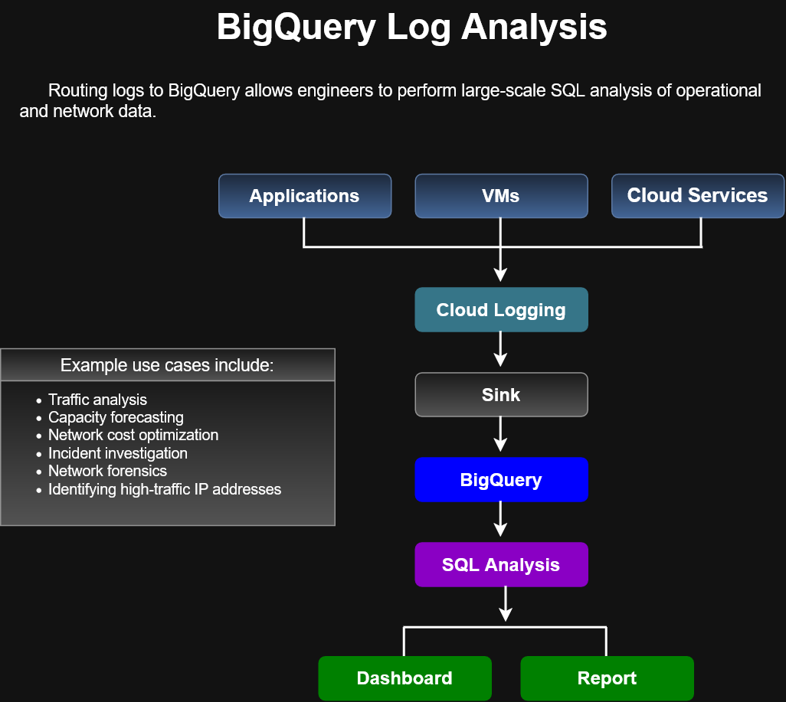

Example use cases include:

- Traffic analysis
- Capacity forecasting
- Network cost optimization
- Incident investigation
- Network forensics
- Identifying high-traffic IP addresses

---

## Error Reporting

Error Reporting is a Google Cloud Observability service that counts,
analyzes, and aggregates errors from running cloud services.

It provides a centralized interface where errors can be:

- Grouped
- Sorted
- Filtered
- Reviewed
- Monitored with notifications

Real-time notifications can be configured when new errors are detected.

### Supported Services

The course lists support for:

- App Engine
- Apps Script
- Compute Engine
- Cloud Run
- Cloud Run functions
- Google Kubernetes Engine (GKE)
- Amazon EC2

### Supported Languages

The exception stack trace parser can process:

- Go
- Java
- .NET
- Node.js
- PHP
- Python
- Ruby

### Conceptual Flow

```text
Application / Cloud Service
          ↓
      Exception
          ↓
    Error Reporting
          ↓
 Count / Analyze / Aggregate
          ↓
 Centralized Error Dashboard
          ↓
 Filter / Investigate / Notify
```
## ACE Recognition

Repeated application exceptions
→ Error Reporting

Need to group similar failures
→ Error Reporting

Need notification when a new application error appears
→ Error Reporting

Need raw log searching
→ Cloud Logging

## Logging vs Error Reporting

| Need                                  | Service         |
| ------------------------------------- | --------------- |
| Search raw log entries                | Cloud Logging   |
| Filter application/system logs        | Cloud Logging   |
| Group repeated application exceptions | Error Reporting |
| Track occurrence of recurring errors  | Error Reporting |
| Notify when new errors appear         | Error Reporting |

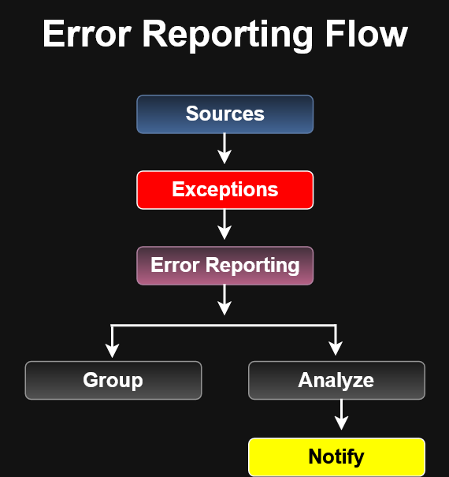

---

## Cloud Trace

Cloud Trace is a distributed tracing system that collects latency data
from applications and displays performance information in the Google
Cloud console.

It helps engineers understand how requests propagate through an
application and where latency is introduced.

### Core Capabilities

Cloud Trace provides:

- Near real-time trace data
- Latency reporting
- Per-URL latency sampling
- Request-path analysis
- Performance degradation detection

### Trace Sources

The course identifies trace data from:

- App Engine
- Global external Application Load Balancers
- Applications instrumented with the Cloud Trace API

### Conceptual Flow

```text
User Request
     ↓
Application
     ↓
Service A
     ↓
Service B
     ↓
Database / Backend
     ↓
Cloud Trace
     ↓
Latency Analysis
     ↓
Performance Insight
```
### Cloud Trace helps answer questions such as:
```text
- Where is the request slowing down?

- Which service contributes the most latency?

- Did application latency increase over time?

- Which URL or request path is performing poorly?

```
## ACE Recognition

Request latency
→ Cloud Trace

Distributed request path
→ Cloud Trace

Need to identify a slow service in a request chain
→ Cloud Trace

Need raw application logs
→ Cloud Logging

Need grouped exceptions
→ Error Reporting

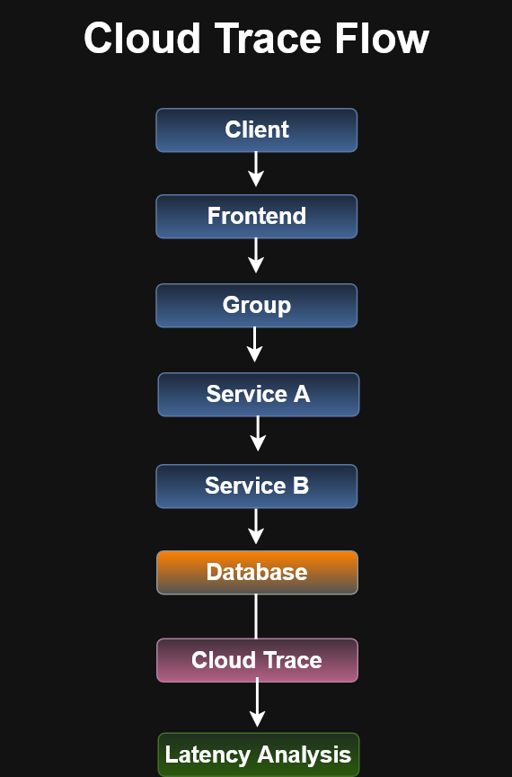

---

## Cloud Profiler

Cloud Profiler continuously analyzes application performance to identify
CPU-intensive and memory-intensive functions.

It is designed for production environments and uses statistical techniques
with low-impact instrumentation so profiling can run across production
application instances without significantly slowing the application.

### Why Profiling Matters

Poorly performing code can increase:

- Application latency
- Infrastructure cost
- CPU consumption
- Memory consumption

Development-time profiling does not always reflect production behavior, so
Cloud Profiler provides visibility into how code actually performs under
real workloads.

### Core Capabilities

Cloud Profiler can:

- Continuously analyze production performance
- Identify CPU-intensive functions
- Identify memory-intensive functions
- Run with low instrumentation overhead
- Analyze applications across production instances

### Environments

The course notes that Profiler can analyze applications running in:

- Google Cloud
- Other cloud platforms
- On-premises environments

### Supported Languages

The course lists support for:

- Java
- Go
- Node.js
- Python

### Conceptual Flow

```text
Production Application
        ↓
Profiler Instrumentation
        ↓
CPU / Memory Samples
        ↓
Cloud Profiler
        ↓
Performance Analysis
        ↓
Hot Functions / Bottlenecks
        ↓
Code Optimization
```
## ACE Recognition

High CPU inside application code
→ Cloud Profiler

Memory-intensive functions
→ Cloud Profiler

Slow request across multiple services
→ Cloud Trace

Repeated application exceptions
→ Error Reporting

Raw event or application records
→ Cloud Logging

### Trace vs Profiler
| Question                                   | Service        |
| ------------------------------------------ | -------------- |
| Where is a request slowing down?           | Cloud Trace    |
| Which function is consuming CPU?           | Cloud Profiler |
| Which function is using excessive memory?  | Cloud Profiler |
| How does a request travel across services? | Cloud Trace    |

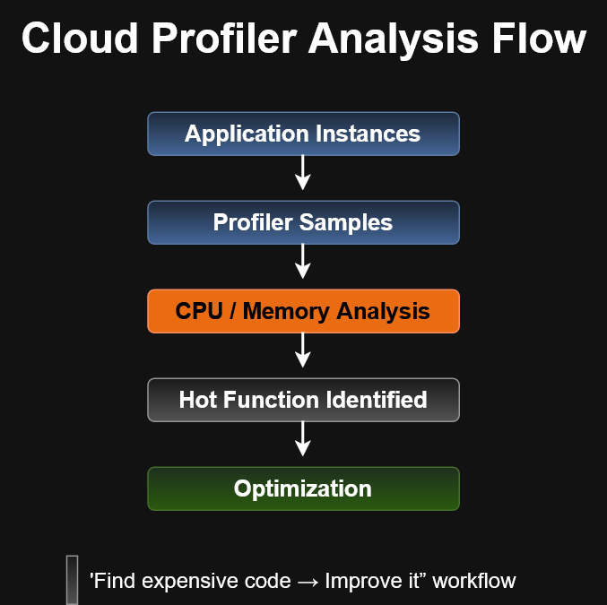

---

## Partner Integrations

Google Cloud Observability can integrate with third-party monitoring,
operations, security, and analytics platforms.

These integrations extend observability beyond native Google Cloud
resources and can support hybrid-cloud and on-premises environments.

### BindPlane Integration

The course shows BindPlane collecting logs and metrics from on-premises
systems and forwarding them into Google Cloud Observability.

Conceptually:

```text
On-Premises Sources
        │
        ├── Logs
        │    ↓
        │ Cloud Logging API
        │    ↓
        │ Cloud Logging
        │
        └── Metrics
             ↓
          BindPlane
             ↓
      Cloud Monitoring API
             ↓
       Cloud Monitoring
```
Once logs are ingested into Cloud Logging, they can be:

- Viewed and searched
- Used to create log-based metrics
- Monitored alongside other metrics
- Used for alerts
- Routed to other destinations

Cloud Logging can also route data to:

- Pub/Sub
- Cloud Storage
- BigQuery

## Partner Integrations part 2

Google Cloud Observability can integrate with on-premises and third-party
platforms for monitoring, logging, and analysis.

### On-Premises Observability with BindPlane

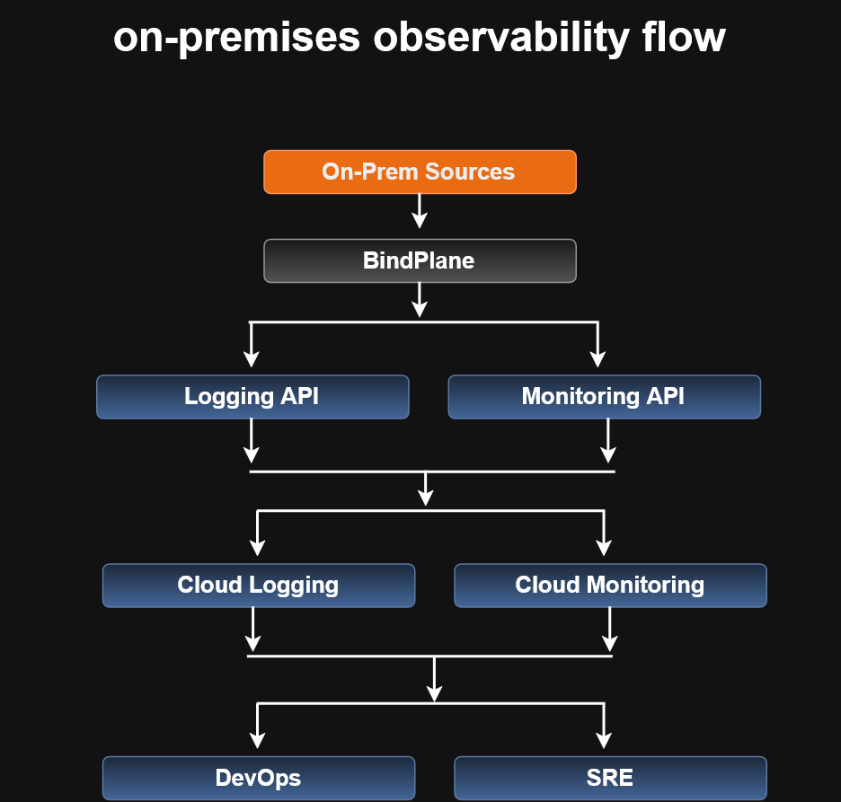

This flow shows how on-premises telemetry can be sent through BindPlane
into Cloud Logging and Cloud Monitoring.

### Splunk Log Export Architecture

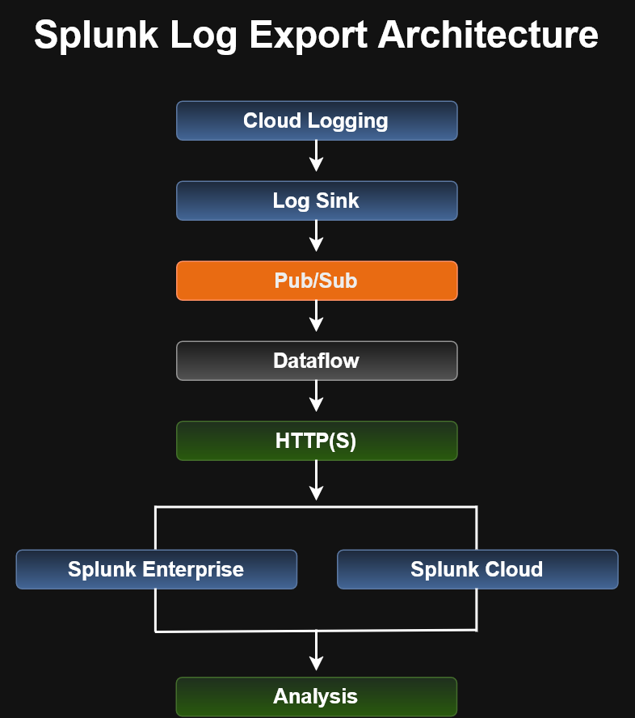

This flow shows how Cloud Logging can export log data through a log sink,
Pub/Sub, and Dataflow before delivery to Splunk.

### Failure Recovery

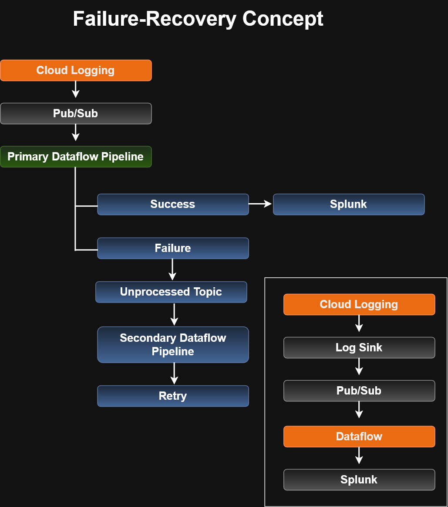

This flow shows how failed log-delivery messages can be routed to an
unprocessed topic and retried through a secondary Dataflow pipeline.

---

## Module Review / ACE Recognition

```text
Site Reliability Engineering foundation
→ Monitoring

Application latency analysis
→ Cloud Trace

Integrated observability
→ Reduces overhead, reduces noise,
  streamlines operations, and helps fix problems faster
```
## Module Review

Google Cloud Observability brings together several operational services:

- Monitoring
- Logging
- Error Reporting
- Cloud Trace
- Cloud Profiler

The course emphasizes that integrating these capabilities into Google Cloud
helps engineers operate and maintain applications more effectively.

This operational discipline is closely associated with **Site Reliability
Engineering (SRE)**.

### Conceptual Summary

```text
Google Cloud Observability
        |
        +-- Monitoring
        +-- Logging
        +-- Error Reporting
        +-- Trace
        +-- Profiler
        |
        v
Operate and maintain applications
        |
        v
Site Reliability Engineering (SRE)
```
---

## ACE Recognition

Monitoring
→ foundational operational visibility

Logging
→ event and log analysis

Error Reporting
→ aggregated application errors

Cloud Trace
→ request latency and tracing

Cloud Profiler
→ CPU and memory performance analysis

Integrated observability
→ supports application operations and maintenance

Operations + reliability practices
→ SRE

```text
Want deeper SRE knowledge?
→ SRE book / SRE courses
```
