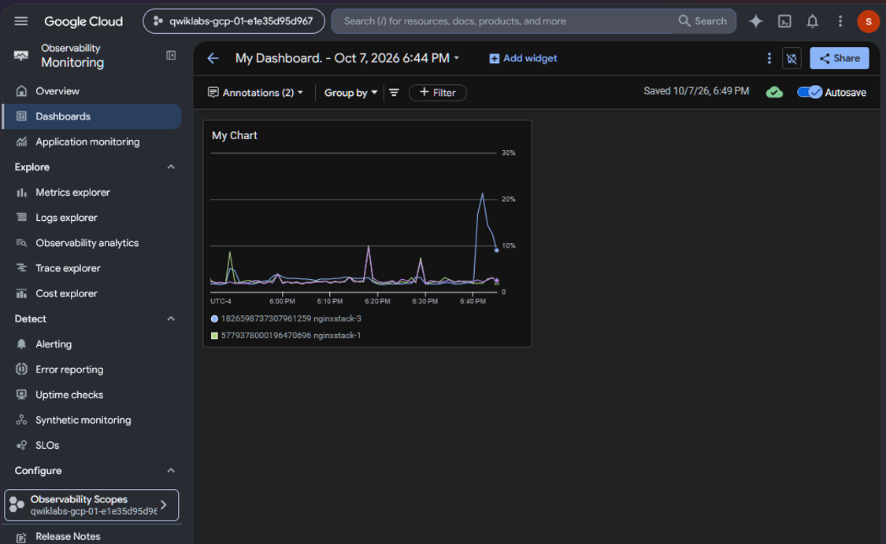
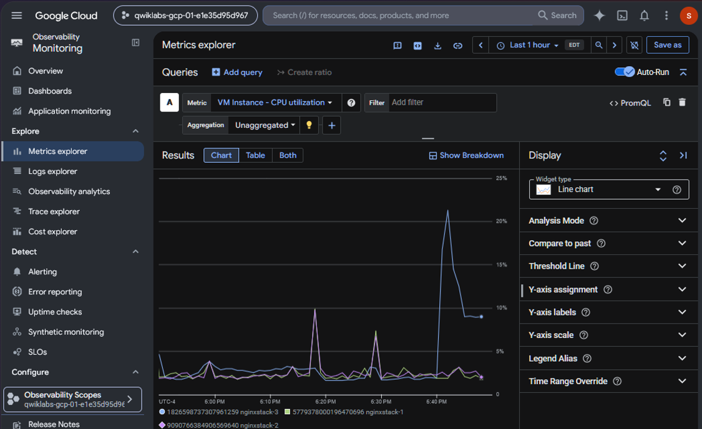
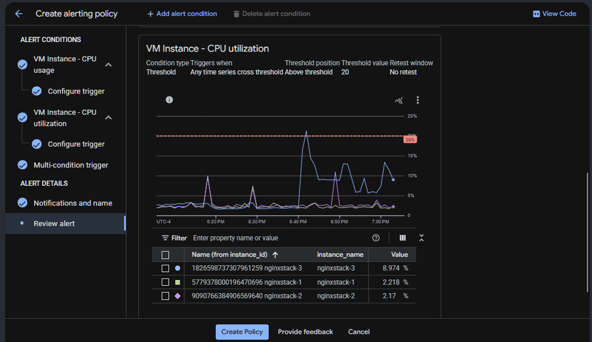
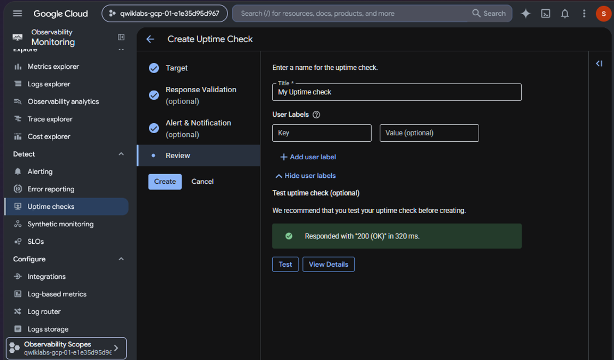

# Monitor Resources with Google Cloud Observability

## Lab Objectives

- Create a custom monitoring dashboard
- Explore VM metrics
- Configure multi-condition alerts
- Create resource groups
- Configure uptime checks

## Hands-on Evidence

### Custom Monitoring Dashboard

### Metrics Explorer

### Alerting Policy

### Uptime Monitoring

