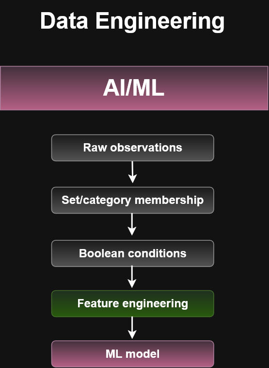

## Computer Science Foundations

Bigtable connects several core computer science concepts with
large-scale cloud data systems.

### Discrete Mathematics

Concepts such as sets, relations, Boolean logic, and mappings help
explain how data can be classified, filtered, and organized.

Examples include:

- Set intersection → records satisfying multiple conditions
- Set union → records satisfying either condition
- Boolean AND / OR / NOT → query predicates
- Cardinality → number of elements or records
- Relations → relationships among data values

---

### Data Structures and Algorithms

Bigtable extends familiar data-structure concepts to distributed
cloud systems.

Important concepts include:

- Key/value mappings
- Sorted keys
- Row keys
- Sparse data structures
- Column families
- Partitioning
- Tablets
- Distributed processing

A useful progression is:

Traditional data structure
→ distributed key/value organization
→ row-key design
→ tablets
→ distributed Bigtable storage

--- 

### AI and Machine Learning

Large-scale AI and machine-learning systems require efficient storage
of observations, events, telemetry, and features.

> Bigtable can serve as high-throughput operational storage for telemetry, observations,
> events, and other data that may feed feature-engineering and machine-learning pipelines.

- IoT telemetry
- Machine-learning feature data
- Time-series observations
- User activity events
- Large-scale analytical datasets
- Operational ML systems

A useful conceptual pipeline is:

Discrete Math
→ Data Structures
→ Distributed Storage
→ Feature Engineering
→ Machine Learning
→ Intelligent Applications

---

## ACE Recognition Note

Use Bigtable when the workload requires:

- Very large NoSQL datasets
- High read/write throughput
- Low latency
- Horizontal scaling
- HBase compatibility

Think:

IoT + telemetry + massive scale + high throughput → Bigtable

---

### Boolean Logic and Data Filtering

Boolean logic can be used to classify telemetry or database records
before the data is used for analytics or machine learning.

Example:

```text
high_temperature = temperature > 90
high_humidity = humidity > 80

danger_condition = high_temperature AND high_humidity
```
| High Temperature | High Humidity | AND Result |
| ---------------- | ------------- | ---------- |
| False            | False         | False      |
| False            | True          | False      |
| True             | False         | False      |
| True             | True          | True       |

This type of Boolean predicate can be used to filter sensor observations,
derive features, trigger alerts, or classify records before storing or
analyzing them.

```markdown

```
```text
Temperature > 90 ──┐
                    ├── AND ──► Danger Condition ──► Bigtable
Humidity > 80 ──────┘
```

---

## Architecture and Concept Diagrams

Supporting diagrams are available in the Bigtable architecture-diagram collection.

### AI/ML Feature Engineering Flow

Shows how raw observations can progress through Boolean logic,
feature engineering, and machine-learning processing.

[View diagram](../../architecture-diagrams/storage/bigtable/ai-ml-feature-engineering-flow.png)

### Discrete Math to Bigtable

Connects discrete mathematics concepts with database filtering,
row-key design, column-family design, and Bigtable queries.

[View diagram](../../architecture-diagrams/storage/bigtable/discrete-math-to-bigtable-flow.png)

### Computer Science to AI/Business Flow

Shows the larger progression from computer science foundations through
distributed storage, IoT telemetry, AI/ML, and operational applications.

[View diagram](../../architecture-diagrams/storage/bigtable/computer-science-to-bigtable-ai-business-flow.png)

### 

---

## Related Academic Foundations

This topic reinforces concepts studied in:

- Discrete Mathematics
- Data Structures and Algorithms
- Database Management Systems
- Artificial Intelligence and Machine Learning
- Internet of Things
