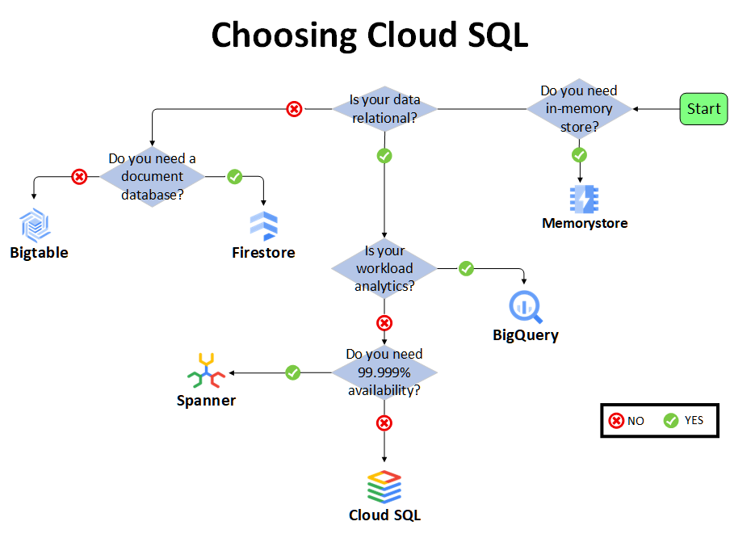

# Cloud SQL

Cloud SQL is a fully managed relational database service in Google Cloud.

It supports:
- MySQL
- PostgreSQL
- Microsoft SQL Server

## Why Use Cloud SQL Instead of Running a Database on Compute Engine?

With Cloud SQL, Google manages much of the database infrastructure, including:

- Patches and updates
- High-availability configuration
- Backups and point-in-time recovery
- Import and export operations
- Scaling options

You still manage database users and application-level database access.

## High Availability

A regional HA configuration uses:

- A primary instance
- A standby instance in another zone
- Synchronous replication to persistent disks

If the primary instance or zone fails, the standby can become the new primary. This process is called **failover**.

## Scaling

Cloud SQL can scale:

- **Up** by increasing machine capacity
- **Out** by using read replicas

For workloads requiring horizontal scalability or global availability, consider Spanner.

## Connecting to Cloud SQL

### Within Google Cloud

For workloads in Google Cloud, Private IP can provide secure private connectivity without exposing database traffic to the public internet.

### Outside Google Cloud

Common connection options include:

- Cloud SQL Auth Proxy
- Manual SSL certificates
- Authorized networks

The Cloud SQL Auth Proxy can automate authentication, encryption, and key rotation.

## Choosing Cloud SQL

Use Cloud SQL when:

- Your data is relational
- Your workload is not primarily analytical
- You do not require the horizontal scaling or global availability provided by Spanner

