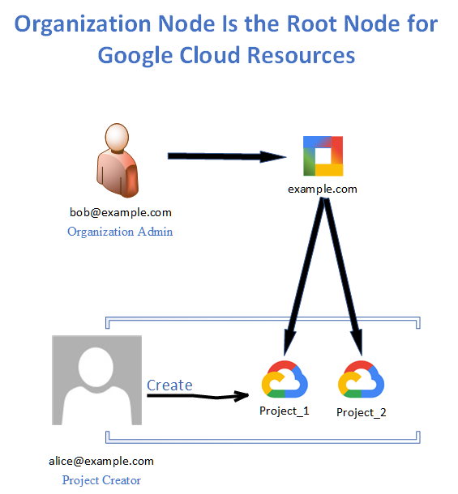
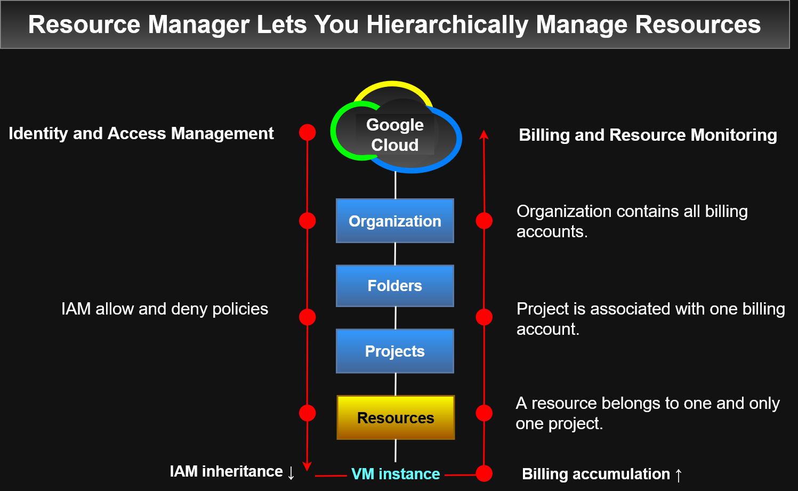
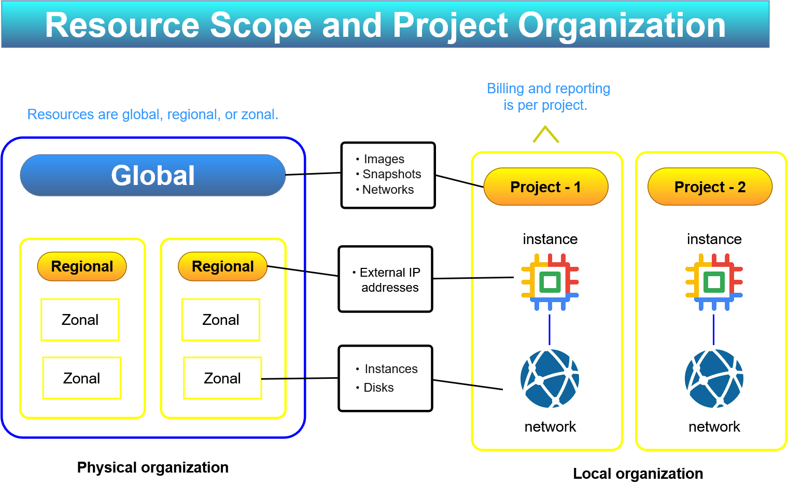
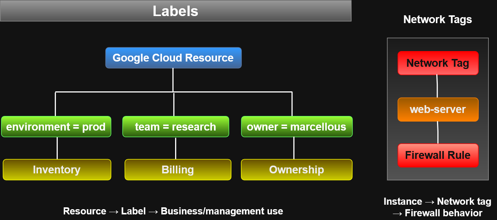

# Resource Manager Diagrams

Architecture diagrams documenting Google Cloud Resource Manager concepts.

## Organization and Project Delegation



Shows:

- Organization as the root resource
- Organization Admin
- Project Creator delegation
- Projects under the organization

---

## Resource Manager Hierarchy



Shows:

- Organization
- Folders
- Projects
- Resources
- IAM policy inheritance
- Billing and resource consumption flow

Key concept:

**IAM inheritance flows downward, while resource consumption and billing
accumulate upward.**

---

## Resource Scope and Projects



Shows the relationship between:

- Global resources
- Regional resources
- Zonal resources
- Projects
- Billing and reporting boundaries

Examples:

| Scope | Examples |
|---|---|
| Global | Images, snapshots, networks |
| Regional | External IP addresses |
| Zonal | VM instances, disks |

---

## Editable Sources

Editable versions are included for future modification:

- `.drawio` — diagrams.net
- `.vsdx` — Microsoft Visio
- `.svg` — scalable vector export
- `.png` — GitHub preview image

---

## ## Quotas

Google Cloud resources are subject to quotas and limits.

Quotas help control how much of a resource can be consumed within a
project or region.

### Common Quota Types

Quotas commonly limit:

- How many resources can be created per project
- How quickly API requests can be made
- How many resources can be created in a region

Examples from this lesson include:

- 15 VPC networks per project
- 5 Spanner administrative actions per second per project
- 24 CPUs per region by default

> Quota values can change over time, so current values should be checked
> in the Google Cloud console or current documentation.

### Why Quotas Exist

Quotas help:

- Prevent runaway resource consumption
- Reduce the risk of unexpected billing spikes
- Limit damage caused by configuration errors or malicious activity
- Force capacity planning and sizing decisions
- Encourage periodic review of resource requirements

For example, accidentally requesting 100 Compute Engine instances instead
of 10 could otherwise create significant cost very quickly.

### Requesting More Quota

If additional capacity is required, quota increases can be requested from
the Google Cloud quota management interface when the quota is adjustable.

Current quota usage and limits can also be reviewed there.

### Important Distinction

Quota does **not** guarantee resource availability.

For example:

```text
Available quota for Local SSD
           ≠
Guaranteed Local SSD capacity
```
Even if quota remains, a resource might temporarily be unavailable in a
particular region.

---

## Labels

Labels are user-defined key-value pairs used to organize Google Cloud resources.

Labels can be attached to resources such as:

- Virtual machines
- Disks
- Snapshots
- Images

They can be created and managed using:

- Google Cloud console
- `gcloud`
- Resource Manager API

A resource can have multiple labels.

### Common Label Uses

Labels can identify:

- Environment
- Team
- Cost center
- Application component
- Resource owner
- Resource state

Examples:

```text
environment=production
environment=test

team=marketing
team=research

component=redis
component=frontend

owner=gaurav
contact=opm

state=inuse
state=readyfordeletion
```
### Why Labels Matter

Labels can help with:

- Resource inventory
- Cost analysis
- Budgeting
- Bulk operations
- Automation scripts
- Resource ownership tracking
- Environment separation

For example, a script could locate all resources with:
```text
environment=production
```
and perform an inventory or maintenance operation on that group.

### Labels vs Network Tags

Do not confuse labels with network tags.
| Feature                | Labels                | Network Tags |
| ---------------------- | --------------------- | ------------ |
| Format                 | Key-value pairs       | Strings      |
| Primary purpose        | Resource organization | Networking   |
| Billing use            | Yes                   | No           |
| Inventory/search       | Yes                   | Limited      |
| Firewall rules         | No                    | Yes          |
| Static route targeting | No                    | Yes          |
| Applied primarily to   | Many resource types   | VM instances |

---

## ACE Recognition Notes
Remember:
```text
Quota = permission/capacity limit
Availability = whether Google Cloud currently has the resource available
```
Having quota does not guarantee capacity.

Also distinguish quotas from budgets:
```text
Quota  → limits resource consumption
Budget → monitors spending and can generate alerts
```
```text
                 Google Cloud Quotas
                         |
        +----------------+----------------+
        |                |                |
   Resource Count     API Rate       Regional Capacity
        |                |                |
  VPC networks      Requests/sec       CPUs/region
```
Why?
```text
Error protection
      +
Cost protection
      +
Capacity planning
```
```text
Quota ≠ guaranteed availability
```
```text
Labels → organization, cost, inventory, ownership

Network tags → firewall rules and networking
```
A useful shortcut:
```text
environment=prod → Label

web-server → Network tag
```

