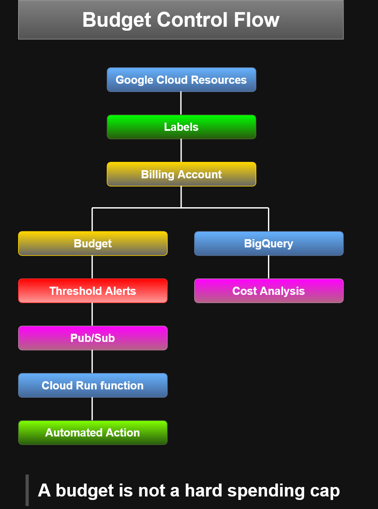
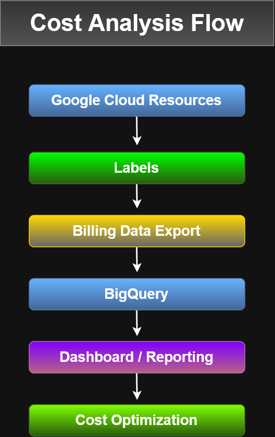

# Resource Manager Diagrams

Architecture diagrams documenting Google Cloud Resource Manager concepts.

## Organization and Project Delegation


Shows:

- Organization as the root resource
- Organization Admin
- Project Creator delegation
- Projects under the organization

---

## Resource Manager Hierarchy


Shows:

- Organization
- Folders
- Projects
- Resources
- IAM policy inheritance
- Billing and resource consumption flow

Key concept:

**IAM inheritance flows downward, while resource consumption and billing
accumulate upward.**

---

## Resource Scope and Projects


Shows the relationship between:

- Global resources
- Regional resources
- Zonal resources
- Projects
- Billing and reporting boundaries

Examples:

| Scope | Examples |
|---|---|
| Global | Images, snapshots, networks |
| Regional | External IP addresses |
| Zonal | VM instances, disks |

---

## Editable Sources

Editable versions are included for future modification:

- `.drawio` — diagrams.net
- `.vsdx` — Microsoft Visio
- `.svg` — scalable vector export
- `.png` — GitHub preview image

---

## ## Quotas

Google Cloud resources are subject to quotas and limits.

Quotas help control how much of a resource can be consumed within a
project or region.

### Common Quota Types

Quotas commonly limit:

- How many resources can be created per project
- How quickly API requests can be made
- How many resources can be created in a region

Examples from this lesson include:

- 15 VPC networks per project
- 5 Spanner administrative actions per second per project
- 24 CPUs per region by default

> Quota values can change over time, so current values should be checked
> in the Google Cloud console or current documentation.

### Why Quotas Exist

Quotas help:

- Prevent runaway resource consumption
- Reduce the risk of unexpected billing spikes
- Limit damage caused by configuration errors or malicious activity
- Force capacity planning and sizing decisions
- Encourage periodic review of resource requirements

For example, accidentally requesting 100 Compute Engine instances instead
of 10 could otherwise create significant cost very quickly.

### Requesting More Quota

If additional capacity is required, quota increases can be requested from
the Google Cloud quota management interface when the quota is adjustable.

Current quota usage and limits can also be reviewed there.

### Important Distinction

Quota does **not** guarantee resource availability.

For example:

```text
Available quota for Local SSD
           ≠
Guaranteed Local SSD capacity
```
Even if quota remains, a resource might temporarily be unavailable in a
particular region.

---

## Labels

Labels are user-defined key-value pairs used to organize Google Cloud resources.

Labels can be attached to resources such as:

- Virtual machines
- Disks
- Snapshots
- Images

They can be created and managed using:

- Google Cloud console
- `gcloud`
- Resource Manager API

A resource can have multiple labels.

### Common Label Uses

Labels can identify:

- Environment
- Team
- Cost center
- Application component
- Resource owner
- Resource state

Examples:

```text
environment=production
environment=test

team=marketing
team=research

component=redis
component=frontend

owner=gaurav
contact=opm

state=inuse
state=readyfordeletion
```
### Why Labels Matter

Labels can help with:

- Resource inventory
- Cost analysis
- Budgeting
- Bulk operations
- Automation scripts
- Resource ownership tracking
- Environment separation

For example, a script could locate all resources with:
```text
environment=production
```
and perform an inventory or maintenance operation on that group.

### Labels vs Network Tags

Do not confuse labels with network tags.
| Feature                | Labels                | Network Tags |
| ---------------------- | --------------------- | ------------ |
| Format                 | Key-value pairs       | Strings      |
| Primary purpose        | Resource organization | Networking   |
| Billing use            | Yes                   | No           |
| Inventory/search       | Yes                   | Limited      |
| Firewall rules         | No                    | Yes          |
| Static route targeting | No                    | Yes          |
| Applied primarily to   | Many resource types   | VM instances |

---

## Billing and Cost Management

Google Cloud billing is accumulated from the resources used by projects.
Billing and cost management includes:

- Monitoring resource costs
- Creating budgets
- Configuring alerts
- Reviewing transactions
- Categorizing costs with labels
- Exporting billing data
- Analyzing billing data with BigQuery
- Automating responses with Pub/Sub and Cloud Run functions

---
Budgets help track spending and provide alerts as costs approach defined thresholds.

### Budgets

A budget can be configured for a project or group of projects.

Budget amounts can be based on:

- A specified amount
- Previous spending

Alert thresholds can be triggered using:

- Actual spend
- Forecasted spend

Example thresholds:

- 50%
- 90%
- 100%

> **Important:** A Google Cloud budget is not a hard spending cap.
> It monitors spending and generates notifications when configured
> thresholds are reached.

### Budget Workflow

A budget can be scoped to one or more projects.

The basic workflow is:

```text
Billing
  ↓
Budgets & alerts
  ↓
Create Budget
  ↓
Scope
  ↓
Amount
  ↓
Alert Thresholds
  ↓
Optional Pub/Sub Automation
```
### Budget Alerts

Budget alerts can send email notifications (to billing administrators and other configured
recipients) when spending reaches configured thresholds.

A budget alert can include:

- Project information
- Percentage of budget consumed
- Budget amount
- Threshold exceeded

---

### Programmatic Cost Management

Budget notifications can also be published through Pub/Sub.

This enables automation such as:

```text
Cloud Billing Budget
        ↓
Threshold Reached
        ↓
      Pub/Sub
        ↓
Cloud Run function
        ↓
Automated Response to cost-management action
```
Potential automated actions could include:

- Sending additional notifications
- Creating incident records
- Triggering cost-management workflows
- Flagging unexpectedly expensive resources

> A budget alert monitors spending. It does not automatically stop resource
> `Budget → alert/notification → optional automation`
> consumption unless you build automation around the notification.
> `Budget ≠ automatic shutdown`

#### Budget Alerts and Automation



A budget is not a hard spending cap. Budgets monitor spending and can trigger
alerts or Pub/Sub notifications. Automation can then respond to those
notifications.
---

### Transactions

The Billing Transactions view provides detailed information about:

- Resource charges
- Compute usage
- Disk usage
- Credits
- Billing adjustments

This helps trace a billing total back to individual services and resource usage.

---

## Labels and Billing Analysis

Labels make it possible to categorize resource costs.

#### Examples:
```text
environment=production
team=research
component=frontend
owner=marcellous
```
Billing data can then be analyzed by these labels.

This can help answer questions such as:

- Which team is generating the most cost?
- Which environment costs the most?
- Which application component is expensive?
- Which region or project is generating unexpected network costs?
- Which resources belong to a particular owner?

---

### Billing Data Export

Billing data can be exported for deeper analysis.

#### BigQuery Export

```text
Billing Account
      ↓
Billing Export
      ↓
BigQuery Dataset
      ↓
SQL Queries
      ↓
Cost Analysis
```
A BigQuery dataset must exist before configuring the export.

#### File Export

Billing data can also be exported as files.

Supported examples shown in the course:

- CSV
- JSON

Conceptually:
```text
Billing Data
    ↓
CSV / JSON
    ↓
Cloud Storage Bucket
```
A Cloud Storage bucket must exist before configuring the file export.

---

## Billing Data with BigQuery

Google Cloud billing data can be exported to BigQuery for detailed analysis.

A conceptual query is:
```sql
SELECT
  TO_JSON_STRING(labels) AS labels,
  SUM(cost) AS cost
FROM `project.dataset.table`
GROUP BY labels;
```
This allows spending to be grouped by labels such as:

- Team
- Environment
- Application
- Owner
- Cost center.

---

### Cost Visualization

Billing information can also be visualized using dashboards and reporting tools.

A conceptual flow is:
```text
Google Cloud Resources
        ↓
      Labels
        ↓
 Billing Data Export
        ↓
     BigQuery
        ↓
Dashboard / Reporting
        ↓
Cost Optimization
```
#### Billing Analysis and Cost Optimization



Labels can be included with exported billing data so that BigQuery queries
and dashboards can analyze spending by team, environment, application,
owner, or other business dimensions.


---

## Billing Administration

Google Cloud billing administration includes monitoring costs,
creating budgets, configuring alerts, reviewing transactions,
and exporting billing data for further analysis.

---
## ACE Recognition Notes
Remember:
`Quota = limits how much you can provision or consume.`
`Budget = monitors spending and alerts you.`
`Billing export = sends cost data elsewhere for analysis.`
`Labels = let you categorize resources so spending can be analyzed meaningfully.`
Also remember:
`Quota ≠ guaranteed availability`
Having sufficient quota does not guarantee that Google Cloud currently
has capacity available.

Useful shortcuts:
```text
environment=prod
→ Label

web-server
→ Network tag

Budget
→ monitoring and notification

Quota
→ resource/API limit
```

```text
Quota = resource or API usage limit
Availability = whether Google Cloud currently has the resource available
```
Having quota does not guarantee capacity. A quota is not really a permission. 
IAM controls permission. Quotas control how much of a resource or API operation can be consumed.

So the relationship becomes:
```text
IAM      → Who is allowed to do it?
Quota    → How much can be used?
Budget   → How much money are we approaching?
Billing  → What did we actually consume and pay for?
Labels   → How do we categorize and analyze it?
```

Also distinguish quotas from budgets:
```text
Quota  → limits resource consumption
Budget → monitors spending and can generate alerts
```
```text
                 Google Cloud Quotas
                         |
        +----------------+----------------+
        |                |                |
   Resource Count     API Rate       Regional Capacity
        |                |                |
  VPC networks      Requests/sec       CPUs/region
```
Why?
```text
Error protection
      +
Cost protection
      +
Capacity planning
```
```text
Quota ≠ guaranteed availability
```
```text
Labels → organization, cost, inventory, ownership

Network tags → firewall rules and networking
```
A useful shortcut:
```text
environment=prod → Label

web-server → Network tag
```


### Related Lab

[Examine Billing Data with BigQuery](../../labs/bigquery/examine-billing-data/)
