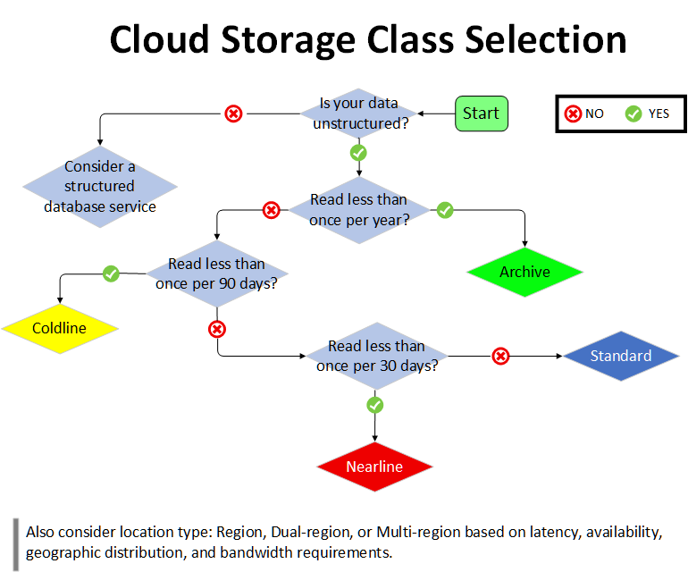
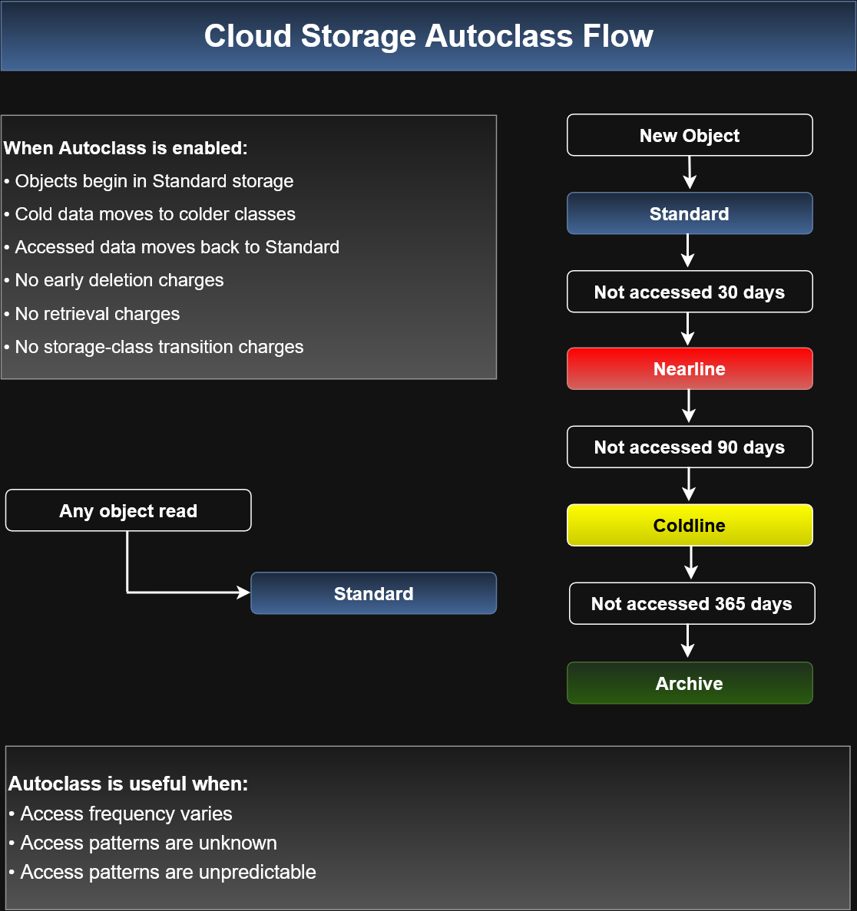
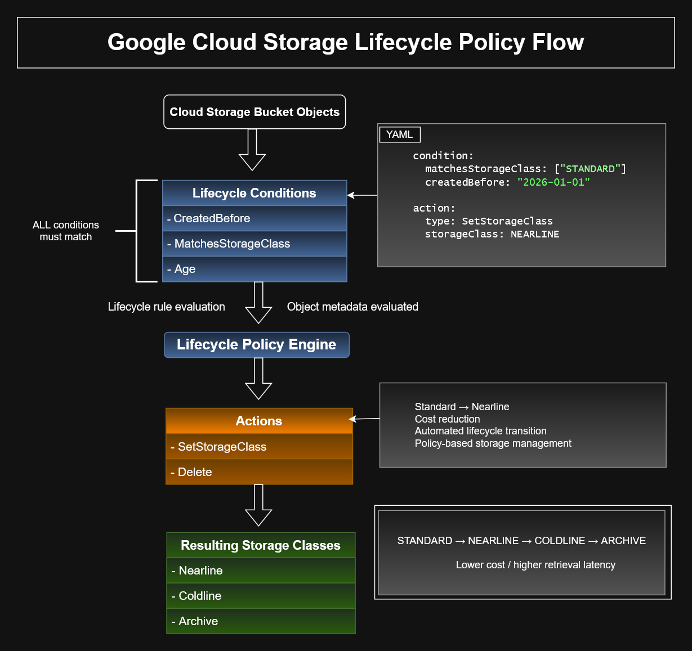

# Google Cloud Storage and Database Services

Google Cloud provides several storage and database services designed for
different data structures, scalability requirements, access patterns, and
application architectures.

This module approaches storage selection from an infrastructure perspective:
identify the workload requirements first, then choose the service that best
supports those requirements.

## Service Categories

| Category | Services |
| --- | --- |
| Object storage | Cloud Storage |
| File storage | Filestore |
| Relational databases | Cloud SQL, Spanner, AlloyDB |
| Non-relational databases | Firestore, Bigtable |
| Data warehouse / analytics | BigQuery |
| In-memory / Redis | Memorystore |

---

# Google Cloud Storage and Database Services

## Storage Service Overview


## Choosing a Storage or Database Service

The service selection process starts with the workload and data requirements.


### Decision Questions

1. **Is your data structured?**
   - No → Do you need a shared file system?
     - Yes → **Filestore**
     - No → **Cloud Storage**
   - Yes → Continue to the next question.

2. **Does your workload involve analytics?**
   - Yes → Do you need extensive updates and/or low latency?
     - Yes → **Bigtable**
     - No → **BigQuery**
   - No → Determine whether the data is relational.

3. **Is your data relational?**
   - No → Do you need application caching?
     - Yes → **Memorystore**
     - No → **Firestore**
   - Yes → Continue to the relational database questions.

4. **Do you need HTAP (hybrid transactional and analytical processing)?**
   - Yes → **AlloyDB**
   - No → Determine whether global scalability is required.

5. **Do you need global scalability?**
   - Yes → **Spanner**
   - No → **Cloud SQL**

## Quick Selection Reference

| Requirement | Service |
| --- | --- |
| Object/unstructured storage | Cloud Storage |
| Shared file system / NAS | Filestore |
| Traditional relational database | Cloud SQL |
| Globally scalable relational database | Spanner |
| HTAP relational workload | AlloyDB |
| Document database | Firestore |
| High-throughput, low-latency NoSQL | Bigtable |
| Large-scale SQL analytics/data warehouse | BigQuery |
| In-memory application caching | Memorystore |

---

# Cloud Storage

Google Cloud Storage is Google Cloud's object storage service.

Typical use cases include:

- Website content
- Archival and disaster recovery
- Distribution of large data objects through direct download

Key characteristics include:

- Scales to exabytes of data
- Millisecond time to first byte
- High availability across storage classes
- A single API across storage classes

---

## Choosing a Cloud Storage Class



### Storage Class Selection Logic
...

## Autoclass



Autoclass automatically manages storage class transitions based on object access patterns.

---
## Buckets and Objects

Cloud Storage is organized around **buckets** and **objects**.

```text
Cloud Storage
     ↓
   Bucket
     ↓
   Object
```
### Buckets
- Must have a globally unique name
- Cannot be nested

### Objects
- Store the actual data
- Usually inherit the bucket's storage class when uploaded
- Can represent text, documents, video, media, and other data
- Can have their storage class changed independently

Cloud Storage is object storage rather than a traditional hierarchical file system.

---

### Storage Classes

| Storage Class | Typical Use                                    | Minimum Storage Duration |
| ------------- | ---------------------------------------------- | -----------------------: |
| Standard      | Frequently accessed or short-lived data        |                     None |
| Nearline      | Infrequently accessed data, backups, archiving |                  30 days |
| Coldline      | Data accessed roughly quarterly or less        |                  90 days |
| Archive       | Long-term archival, backup, disaster recovery  |                 365 days |

### Standard Storage

Best for frequently accessed hot data.

#### Examples:

- Website content
- Streaming content
- Interactive workloads
- Data used by Compute Engine or GKE

### Nearline Storage

Designed for infrequently accessed data where lower storage cost is more important than frequent retrieval.

### Coldline Storage

Designed for even less frequently accessed data and accepts higher retrieval costs in exchange for lower storage cost.

### Archive Storage

Designed for long-term archival, backup, and disaster recovery.

---

## Durability vs. Availability

The storage classes provide very high durability.

A useful distinction is:

- Durability → How likely your data is to remain intact
- Availability → How likely your data is to be accessible at a particular time

High durability does not necessarily mean identical availability across all storage classes.

---

## Changing Storage Classes

When an object is uploaded, it normally receives the bucket's default storage class unless another class is specified.

Existing objects can also have their storage class changed without moving them to another bucket.

This allows less frequently accessed objects to be moved to:

- Nearline
- Coldline
- Archive

to reduce storage cost.

Object Lifecycle Management can automate these transitions.

### Object Lifecycle Management

Object Lifecycle Management can automatically change an object's storage class or perform another lifecycle action when defined conditions are met.



---

## Cloud Storage Access Control

Cloud Storage supports several access-control mechanisms.

### IAM

IAM can control access to Cloud Storage resources at broader scopes.

Typical permissions include the ability to:

- View buckets
- List objects
- View object names
- Create buckets

IAM roles can be inherited through the resource hierarchy.

### Access Control Lists — ACLs

ACLs provide finer-grained access control.

An ACL entry contains:
```text
Scope + Permission
```
Examples of scope:

- Specific user
- Group
- allUsers
- allAuthenticatedUsers

Examples of permission:

- Owner
- Writer
- Reader

### Signed URLs

Signed URLs provide temporary access to a specific Cloud Storage resource.

Conceptually:
```text
Service Account Private Key
        ↓
Signed URL
        ↓
Specific Cloud Storage Resource
        ↓
Access expires after a defined period
```
A signed URL can grant temporary read or write access without requiring the recipient to authenticate using their own Google account.

Because anyone holding the URL may be able to use it until it expires, expiration time should be limited appropriately.

---

## Cloud Storage Access Methods

Cloud Storage can be accessed using:

- `gcloud storage`
- JSON API
- XML API

---


## Storage Service Selection


The selection process begins with the structure and access characteristics
of the data rather than the database product itself.
