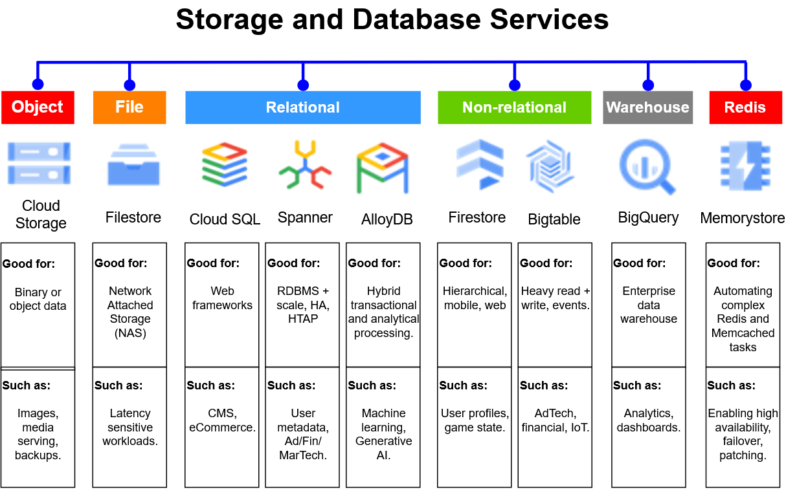
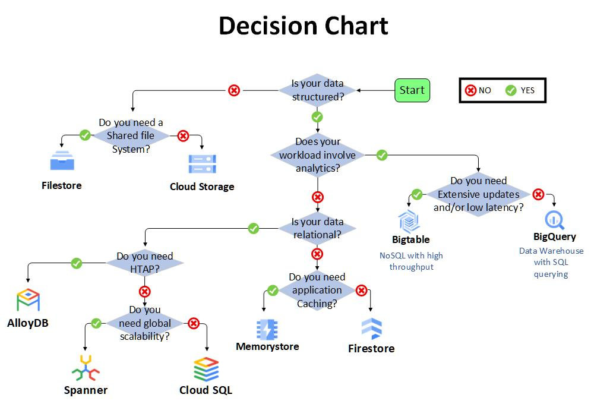

# Google Cloud Storage and Database Services

Google Cloud provides several storage and database services designed for
different data structures, scalability requirements, access patterns, and
application architectures.

This module approaches storage selection from an infrastructure perspective:
identify the workload requirements first, then choose the service that best
supports those requirements.

## Service Categories

| Category | Services |
| --- | --- |
| Object storage | Cloud Storage |
| File storage | Filestore |
| Relational databases | Cloud SQL, Spanner, AlloyDB |
| Non-relational databases | Firestore, Bigtable |
| Data warehouse / analytics | BigQuery |
| In-memory / Redis | Memorystore |

---

# Google Cloud Storage and Database Services

## Storage Service Overview

## Choosing a Storage or Database Service

The service selection process starts with the workload and data requirements.

### Decision Questions

1. **Is your data structured?**
   - No → Do you need a shared file system?
     - Yes → **Filestore**
     - No → **Cloud Storage**
   - Yes → Continue to the next question.

2. **Does your workload involve analytics?**
   - Yes → Do you need extensive updates and/or low latency?
     - Yes → **Bigtable**
     - No → **BigQuery**
   - No → Determine whether the data is relational.

3. **Is your data relational?**
   - No → Do you need application caching?
     - Yes → **Memorystore**
     - No → **Firestore**
   - Yes → Continue to the relational database questions.

4. **Do you need HTAP (hybrid transactional and analytical processing)?**
   - Yes → **AlloyDB**
   - No → Determine whether global scalability is required.

5. **Do you need global scalability?**
   - Yes → **Spanner**
   - No → **Cloud SQL**

## Quick Selection Reference

| Requirement | Service |
| --- | --- |
| Object/unstructured storage | Cloud Storage |
| Shared file system / NAS | Filestore |
| Traditional relational database | Cloud SQL |
| Globally scalable relational database | Spanner |
| HTAP relational workload | AlloyDB |
| Document database | Firestore |
| High-throughput, low-latency NoSQL | Bigtable |
| Large-scale SQL analytics/data warehouse | BigQuery |
| In-memory application caching | Memorystore |

## Storage Service Selection

The selection process begins with the structure and access characteristics
of the data rather than the database product itself.
